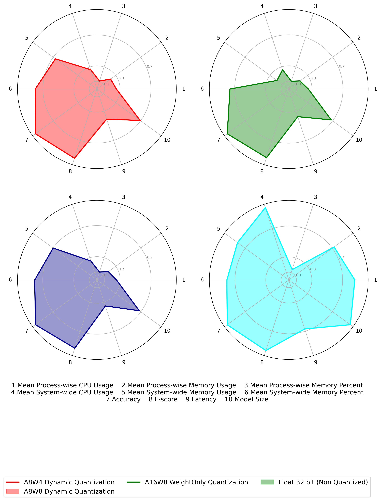

after run the 3 kinds of quantized pte model and the orignal pth model
I find the process of running executorch with cpp is executor_runner(which is the executable file we create)
I find the process of running orignal python model and executorch with python  is pt_main_thread(which is the process of pytorch)

mkdir -p ~/miniconda3
wget https://repo.anaconda.com/miniconda/Miniconda3-latest-Linux-aarch64.sh -O ~/miniconda3/miniconda.sh
bash ~/miniconda3/miniconda.sh -b -u -p ~/miniconda3
rm ~/miniconda3/miniconda.sh

https://drive.google.com/file/d/16qTqzRGv-g5BUJ3-SFlww-sge7vXe7bo/view?usp=sharing

we can get result of cpu usage and memory usage.      psutil.cpu_count()=4

| model          | process cpu usage | process memory usage(MB) | process memory percent | system cpu usage | system memory usage(MB) | system memory usage percent |
| -------------- | ----------------- | ------------------------ | ---------------------- | ---------------- | ----------------------- | --------------------------- |
| a8w4 python    | 25.20%            | 343.83                   | 4.35%                  | 26.32%           | 2166.25                 | 31.97%                      |
| a8w4  cpp      | 25.13%            | 45.57                    | 0.58%                  | 25.60%           | 1994.89                 | 29.52%                      |
| a8w8 python    | 25.24%            | 335.55                   | 4.25%                  | 26.18%           | 2047.07                 | 30.43%                      |
| a8w8 cpp       | 25.05%            | 37.85                    | 0.48%                  | 25.64%           | 2026.54                 | 29.95%                      |
| w8only python  | 25.23%            | 336.43                   | 4.26%                  | 25.75%           | 2174.38                 | 32.08%                      |
| w8only cpp     | 24.97%            | 36.58                    | 0.46%                  | 25.76%           | 2018.61                 | 29.84%                      |
| orignal python | 85.89%            | 445.73                   | 5.64%                  | 98.84%           | 2206.37                 | 32.23%                      |

the result with python on cpu

| model   | Accuracy | F-score  | Latency(s)         | Model Size(bytes) |
| ------- | -------- | -------- | ------------------ | ----------------- |
| a8w4    | 0.985513 | 0.942169 | 2.8647997991299134 | 20766072          |
| a8w8    | 0.982718 | 0.931772 | 2.6266351785839372 | 20332280          |
| w8only  | 0.980928 | 0.925058 | 2.46934628935588   | 20246248          |
| origanl | 0.9911   | 0.9646   | 4.689765601493677  | 29685120          |

